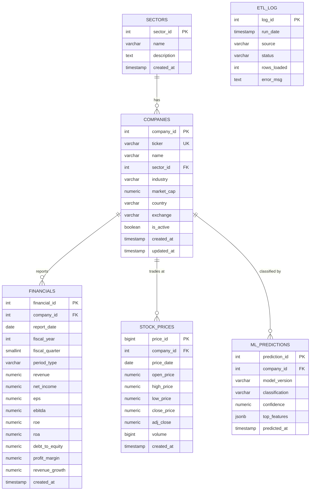

# Stock Platform

A full-stack financial advisor platform built as a database-focused capstone project. It combines a normalized PostgreSQL data warehouse, an ASP.NET Core REST API, a Python AI/data engine, and a React dashboard.

  

---

## Project Status

| Layer | Status | Notes |
|-------|--------|-------|
| ASP.NET Core API | ✅ Running | All CRUD endpoints live |
| PostgreSQL | ✅ Connected | Schema created via SQL scripts |
| EF Core Migrations | ✅ Done | `InitialBaseline` (empty baseline) applied |
| Scalar API Docs | ✅ Live | `http://localhost:5000/scalar/v1` |
| DB Schema + ER Diagram | ✅ Done | Partitioned tables, indexes, stored procs, materialized views |
| Python AI Service | 🔜 Week 5-6 | FastAPI + ETL |
| React Frontend | 🔜 Week 7-8 | Dashboard + Charts |
| ML Model | 🔜 Week 9-10 | Random Forest classifier |
| LLM SQL Generator | 🔜 Week 11 | Natural language to SQL |

---

## Architecture

```
React + TypeScript
       │
  REST API Calls
       │
 ASP.NET Core Web API
       │
Entity Framework Core / Npgsql
       │
  PostgreSQL Database
  ├── Materialized Views
  ├── Stored Procedures
  ├── Indexes
  ├── Partitioning
  └── ETL Tables
       │
  Python AI Service (FastAPI)
  ├── ETL Pipeline
  ├── Feature Engineering
  ├── ML Model (Random Forest)
  ├── LLM SQL Generator
  └── Model Training
```

> ASP.NET Core never talks directly to Yahoo Finance or the LLM. It only communicates with PostgreSQL and the Python AI service.

---

## Database Design

### ER Diagram



### Key Design Decisions

- **`financials` is partitioned by `fiscal_year`** — yearly partitions (2020–2025) so queries scoped to a year skip irrelevant partitions entirely
- **Ratios pre-computed at load time** — `roe`, `roa`, `debt_to_equity`, `revenue_growth` stored on the row so ML feature extraction is a simple `SELECT`
- **Trigram GIN indexes on `companies.name` and `ticker`** — enables fast fuzzy search (`ILIKE '%apple%'`) used by the React search bar
- **3 materialized views** — `mv_company_summary` (latest financials + price per company), `mv_sector_aggregates` (sector-level KPIs), `mv_growth_trends` (LAG-windowed YoY data for ML training)
- **`etl_log` table** — every nightly ETL run is recorded with row counts and error messages for observability

### Database Files

```
database/
├── 01_schema.sql              — All tables + partitions
├── 02_indexes.sql             — 14 indexes (composite, GIN trigram, partial)
├── 03_materialized_views.sql  — 3 views + refresh_all_views()
├── 04_stored_procedures.sql   — 5 stored procedures
├── 05_seed_data.sql           — 10 sectors, 17 companies, 5yr financials
└── 06_run_all.sql             — One-command full setup
```

---

## Tech Stack

### Frontend
- React + TypeScript
- Tailwind CSS
- Recharts / Chart.js

### Backend
- ASP.NET Core 9 Web API
- Entity Framework Core 9
- Npgsql 9
- Microsoft.Extensions.Http.Resilience (circuit breaker)
- Scalar (API docs)

### Database (PostgreSQL 16)
- Normalization
- Indexes + Composite Indexes
- Stored Procedures
- Materialized Views
- Transactions
- Partitioning

### Python AI Service (FastAPI)
- ETL Pipeline (Yahoo Finance → PostgreSQL)
- Feature Engineering
- Random Forest ML Classifier
- LLM → SQL Generator (OpenAI or local model)
- Saved model as `.pkl`

---

## Prerequisites

- [.NET 9 SDK](https://dotnet.microsoft.com/download/dotnet/9.0)
- [Docker Desktop](https://www.docker.com/products/docker-desktop)
- [Node.js 20+](https://nodejs.org/) (for React frontend - coming soon)

---

## Running Locally

> **Important:** The database schema is managed via SQL scripts, not EF migrations. Do not run `dotnet ef database update` before the database is created from the SQL scripts.

### 1. Clone the repo
```bash
git clone https://github.com/SarthakAgrawal442/stock-platform.git
cd stock-platform
```

### 2. Start PostgreSQL via Docker
```bash
docker compose up postgres -d
```

### 3. Create the database schema + seed data
```bash
# Copy SQL files into the container
docker cp database/. stockplatform_db:/tmp/database/

# Run from inside the container (paths resolve correctly from /tmp)
docker exec -it stockplatform_db bash
cd /tmp
psql -U postgres -d stockplatform -f database/06_run_all.sql
exit
```

This creates all tables, indexes, materialized views, stored procedures, and loads seed data (10 sectors, 17 companies, 5 years of financials).

### 4. Run the API
```bash
cd StockPlatform.API
dotnet restore
dotnet ef database update
dotnet run
```

> `dotnet ef database update` here just registers the `InitialBaseline` record in `__EFMigrationsHistory`. It does NOT recreate tables — the schema already exists from Step 3.

### 5. Open API docs
```
http://localhost:5000/scalar/v1
```

### Verify it's working
```bash
# Should return 17 companies with sectorName populated
curl http://localhost:5000/api/companies
```

---

## Services

| Service | URL |
|---------|-----|
| React Frontend | http://localhost:3000 |
| ASP.NET API | http://localhost:5000 |
| Scalar API Docs | http://localhost:5000/scalar/v1 |
| Python AI Service | http://localhost:8000 |
| PostgreSQL | localhost:5432 |

---

## Folder Structure

```
stock-platform/
├── StockPlatform.API/
│   ├── Controllers/
│   ├── Services/
│   ├── Repositories/
│   ├── Models/
│   ├── DTOs/
│   ├── Middleware/
│   │   └── SqlValidationMiddleware.cs
│   ├── Database/
│   ├── Migrations/
│   └── Program.cs
│
├── database/
│   ├── 01_schema.sql
│   ├── 02_indexes.sql
│   ├── 03_materialized_views.sql
│   ├── 04_stored_procedures.sql
│   ├── 05_seed_data.sql
│   └── 06_run_all.sql
│
├── python-service/
│   ├── api/
│   │   ├── main.py
│   │   └── routes/
│   │       ├── predict.py
│   │       ├── etl.py
│   │       └── llm.py
│   ├── etl/
│   ├── ml/
│   │   ├── train.py
│   │   ├── predict.py
│   │   └── models/
│   ├── llm/
│   │   ├── sql_generator.py
│   │   └── prompt_templates/
│   ├── utils/
│   ├── requirements.txt
│   └── Dockerfile
│
├── react-frontend/
│   ├── src/
│   │   ├── components/
│   │   ├── pages/
│   │   ├── hooks/
│   │   └── services/
│   └── package.json
│
├── docker-compose.yml
└── README.md
```

---

## API Endpoints

### Companies
```
GET    /api/companies                   - List all companies
GET    /api/companies/{id}              - Get company by ID
GET    /api/companies/ticker/{ticker}   - Get company by ticker
POST   /api/companies                   - Create company
DELETE /api/companies/{id}              - Delete company
```

### Financials
```
GET    /api/financials/company/{companyId} - Get financials for a company
```

### AI (Python Service - coming Week 5-6)
```
POST   /api/ai/predict   - ML growth classification
POST   /api/ai/query     - Natural language to SQL
GET    /api/ai/health    - Python service health check
```

---

## API Communication

### ML Prediction
```
POST /api/ai/predict
{ "companyId": 105 }

→ {
    "classification": "High Growth",
    "confidence": 0.93,
    "topFeatures": ["Revenue Growth", "ROE", "Low Debt"]
  }
```

### LLM SQL Generation
```
POST /api/ai/query
{ "query": "Find profitable semiconductor companies with growing revenue" }

→ {
    "sql": "SELECT ...",
    "tables_used": ["companies", "financials"]
  }
```

> AI-generated SQL is never executed directly. ASP.NET validates it against a whitelist (SELECT only, known tables, no DROP/DELETE/UPDATE/EXEC).

---

## ETL Pipeline

Runs nightly via scheduler:

```
Yahoo Finance → Download → Clean → Normalize → Load PostgreSQL → Refresh Materialized Views
```

---

## ML Workflow

Training (offline):
```
PostgreSQL → Training Dataset → Random Forest → Saved Model (.pkl)
```

Prediction (runtime):
```
React → ASP.NET → Python → Load Model → Prediction → Return Result
```

---

## LLM SQL Workflow

```
User: "Find profitable semiconductor companies with growing revenue"
→ ASP.NET → Python → OpenAI API → SQL
→ ASP.NET validates SQL → PostgreSQL → Results → React
```

**SQL Validation Rules:**
- Only `SELECT` statements allowed
- Whitelist of allowed tables enforced
- Blocked keywords: `DROP`, `DELETE`, `UPDATE`, `INSERT`, `EXEC`
- Auto-inject `LIMIT 500` if missing

---

## Development Timeline

| Week | Focus | Status | Deliverable |
|------|-------|--------|-------------|
| 1-2 | DB Design | ✅ Done | ER diagram, full schema, indexes, stored procs, seed data |
| 3-4 | ASP.NET Core | ✅ Done | CRUD APIs, EF Core, Scalar docs |
| 5-6 | Python ETL + FastAPI | 🔜 Next | Nightly pipeline, `/health`, `/predict` |
| 7-8 | React Dashboard | 🔜 | Charts, search, company pages |
| 9-10 | ML Model | 🔜 | Random Forest classifier, `.pkl` model |
| 11 | LLM SQL + Validation | 🔜 | Chat UI, SQL guard middleware |
| 12 | Polish | 🔜 | Docker Compose, docs, demo prep |

---

## Why This Project

Most student stock projects are just `Yahoo API → React → Charts` with no real database engineering.

This project puts the database at the core:

```
Financial Data → ETL Pipeline → Normalized PostgreSQL
→ Materialized Views → Stored Procedures → Indexes
→ ML Classification → Natural Language SQL → React Dashboard
```

It demonstrates three distinct skill sets in one project:
- **Software Engineering** - ASP.NET Core 9
- **Database Engineering** - PostgreSQL 16
- **Data Engineering / AI** - Python + ML + LLM

---

## Author

**Sarthak Agrawal** - Computer Science Student
[GitHub](https://github.com/SarthakAgrawal442)
